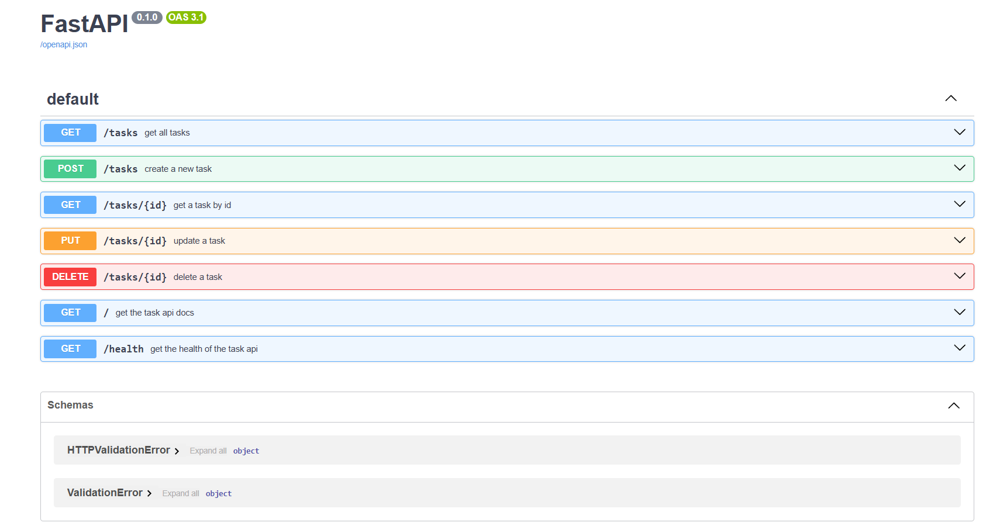

# Task API

A simple RESTful Task Management API built with **FastAPI**. This project demonstrates a complete CRUD (Create, Read, Update, Delete) API using an in-memory list of tasks.

## Features

- View all tasks
- View a task by ID
- Create a new task
- Update an existing task
- Delete a task
- Automatic Swagger API documentation

---

## Installation & Run

### Prerequisites

- Python 3.10+
- FastAPI
- Uvicorn

### Install dependencies

```bash
pip install fastapi uvicorn
```

### Run the application

```bash
uvicorn main:app --reload
```

> Replace `main` with your Python filename if it is different.

The API will be available at:

- API: http://localhost:8000
- Swagger UI: http://localhost:8000/docs
- ReDoc: http://localhost:8000/redoc

---

# API Endpoints

| Method | Endpoint | Description | Success Status |
|---------|----------|-------------|----------------|
| GET | `/` | API information | 200 |
| GET | `/health` | Health check | 200 |
| GET | `/tasks` | Get all tasks | 200 |
| GET | `/tasks/{id}` | Get a task by ID | 200 / 404 |
| POST | `/tasks` | Create a task | 201 / 400 |
| PUT | `/tasks/{id}` | Update a task | 200 / 400 / 404 |
| DELETE | `/tasks/{id}` | Delete a task | 204 / 404 |

---

# Example curl Output

### Create a Task

```bash
curl -i -X POST http://localhost:8000/tasks ^
-H "Content-Type: application/json" ^
-d "{\"title\":\"Buy milk\"}"
```

Example output

```http
HTTP/1.1 201 Created
content-type: application/json

{
  "id": 4,
  "title": "Buy milk",
  "done": false
}
```

---

# Swagger UI

Open the following URL in your browser:

```
http://localhost:8000/docs
```



---

# Project Structure

```
.
├── main.py
├── README.md
└── images
    └── swagger.png
```

---

# Technologies Used

- Python
- FastAPI
- Uvicorn
- Swagger UI (OpenAPI)

---

# Author

Koushal Hegde

---

# Database Checkpoint

**Query:**
```sql
SELECT * FROM tasks WHERE done = 1;
```

**Result:**
It returned all rows where the `done` column was set to 1, proving that the SQLite database is the single source of truth and instantly reflects changes made by hand in DB Browser without a server restart.